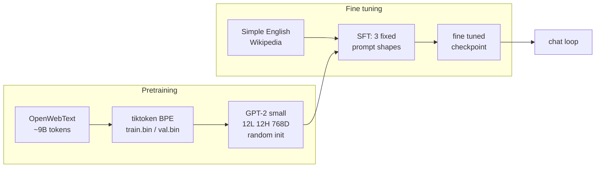
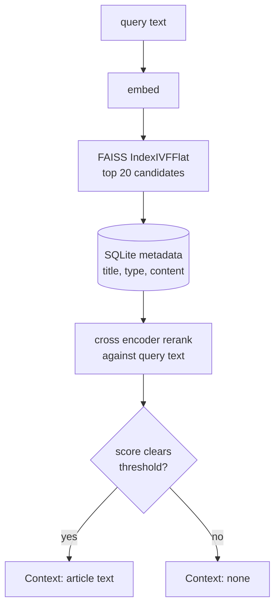
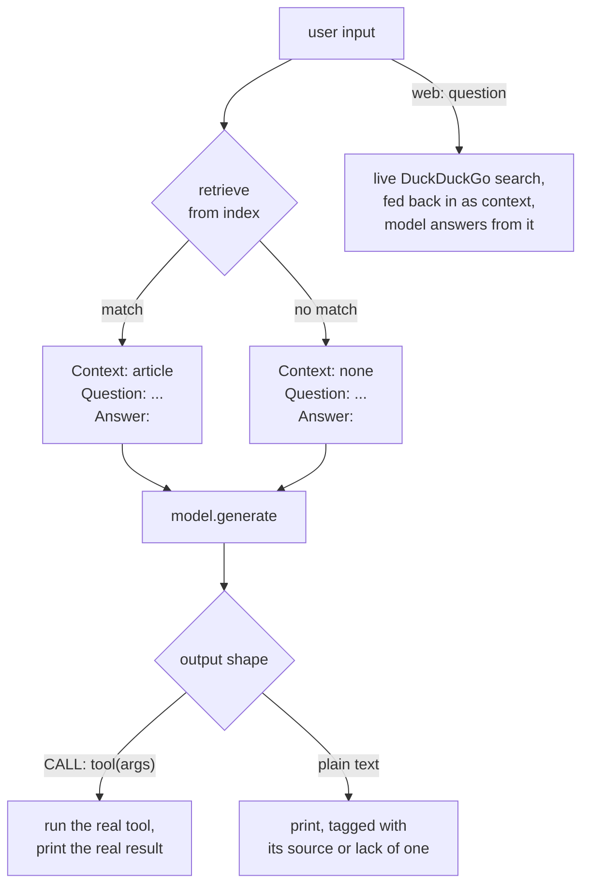

# Tern AI

A GPT-2 sized language model trained from scratch on a single RTX 4070
SUPER, with a self built retrieval and tool use layer around it. No
pretrained weights, random initialization, one consumer GPU.

The finished, fine tuned checkpoint is published at
[huggingface.co/mikahniehaus/Tern](https://huggingface.co/mikahniehaus/Tern)
for anyone who wants to skip the multi day training run and start from a
working model; the model card there covers the checkpoint format and how to
load it with nanoGPT's own `GPT`/`GPTConfig` classes. Everything in this repo
(the training pipeline, the retrieval and tool layer, the chat loop) still
runs the same either way, checkpoint trained locally or downloaded.

## Model

Standard GPT-2 small config: 12 layers, 12 attention heads, 768 embedding
dimensions, 1024 token context window, 124M parameters. Trained on
OpenWebText from random init, roughly one full epoch, about 9 billion
tokens.



Base pretraining and fine tuning are two separate stages with their own
checkpoints. An orchestrator script checks checkpoint state on start and
resumes or advances automatically, so a multi day run can be paused and
picked back up without manual bookkeeping. It also downloads Simple
English Wikipedia on its own and rebuilds the fine tuning dataset whenever
the real inputs change, checked by a content fingerprint, not just whether
the output files happen to exist, so a stale checkpoint never gets treated
as current just because nobody remembered to rebuild by hand.

The retrieval grounded answer shape is trained exclusively on real,
independently written paraphrases, never the retrieved passage copied
verbatim: Simple English Wikipedia is a separate Wikimedia project written
by human editors in simpler language, joined to the regular English corpus
by article title. No generative AI produced any of this training data, in
keeping with the point of the project: an earlier attempt at prompting
the base model itself to paraphrase was tested directly and failed, the
model hallucinated and drifted off topic within a sentence, consistent
with in context learning being unreliable well below 1 billion parameters,
the same reason the fine tuning stage exists in the first place.

An article with no real trained paraphrase is never shown as a grounded
answer at all, rather than falling back to a verbatim copy: the fine
tuning dataset records the exact set of article titles it actually trained
a paraphrase for (60,000 of them), and the chat loop checks a retrieval
hit against that exact list before ever building a `Context:` block from
it, closed loop, no separate approximation of "which titles were trained"
that could quietly drift out of sync with what the data build actually
produced. A title outside that set is treated exactly like a genuine
retrieval miss.

That closed loop is there because the open version was measured wrong. The
first version of the check re-derived "which titles were trained" at answer
time, accepting any article that cleared the same filters the data build
uses. Counting it against what the build actually wrote found 178,363 of
238,363 accepted titles, 74.8%, had never been turned into a training row
at all: the builder streams the corpus in file order and stops once it has
its 60,000, so three quarters of what that gate let through was exactly the
never trained case the gate existed to block. Reading the build's own
output instead leaves one computation of which titles were trained rather
than two that can quietly disagree.

## Retrieval

The knowledge base is 6.4 million Wikipedia articles, embedded with
sentence-transformers and indexed with FAISS (`IndexIVFFlat`, 65,536
clusters, inner product metric). A query gets embedded the same way,
FAISS returns a shortlist of candidates, and a cross encoder reranks that
shortlist against the actual query text.



Raw embedding distance alone isn't reliable at this scale, short or vague
queries can land close to an unrelated article by coincidence, so the
rerank score against the real query text is what gates whether a match
counts as confident. Disambiguation stub pages are filtered out before
reranking so a thin "X may refer to" page never outranks the real article.

## Chat loop

The fine tuned model only ever sees three prompt shapes at training time,
and the chat loop's job is picking the right one at inference time and
grounding it in something real:



A tool call's result is never routed back through the model to be
rephrased. A calculator result is already correct, so the loop prints it as
is instead of giving the model a chance to say something wrong on top of a
right answer. A live search hit is the other case: it is a passage, not an
answer, so it goes back in as a `Context:` block and the model generates
the real answer from it, tagged `AI generated`. Only a search that failed
or returned nothing prints verbatim, since there is no passage there to
ground an answer in.

Two real inference time techniques improve answer quality with no
retraining involved. Nucleus (top-p) sampling narrows the model's word
choice at every token to the smallest set covering 90% of the real
probability mass, instead of a fixed count, so it stops occasionally
sampling a genuinely unlikely word. Best-of-4 reranking generates four
full candidate answers for any real, grounded prompt (a retrieved passage
or a live search result) and keeps the one the same cross encoder already
used for retrieval scores as most relevant to the question, real
retrieval-augmented generation rather than a single roll of the dice.
Both are skipped for tool calls and refusals, on purpose: a tool's real
result and the model's own trained "I don't know" don't get better with
more sampling, only slower.

## Stack

PyTorch, a GPT-2 implementation built from scratch, tiktoken, FAISS,
sentence-transformers for embeddings and reranking, SQLite, ddgs for live
search. Nothing hosted, nothing managed, no third party API for the model
itself.

## Running it

One entry point, `gui.bat`, a small tkinter app with two tabs:

```
Train                     start/stop pretraining, downloading the Simple
                           Wikipedia corpus, and fine tuning, auto resumes
                           and moves to the next stage on its own (including
                           rebuilding the fine tuning dataset and starting a
                           fresh fine tuning run if the data it was trained
                           on ever changes), live log output
Talk to AI                the real interface, needs fine tuning to be done,
                           retrieval, tool use, and everything from full RAG
                           down to closed book answering all live here,
                           picked per question with the Source toggle
```

The Source toggle has four settings, most grounded first:

```
Vector, web if no match      the default: answer from the vector store,
                              falling back to a live DuckDuckGo search when
                              retrieval finds nothing confident or the model
                              refuses the passage it was handed
Vector only                  retrieval still runs, the live search fallback
                              is off, so a refusal is the answer rather than
                              a cue to go look elsewhere
Model only, web if no match  the vector store is off and the model answers
                              on its own, with only its own refusal falling
                              back to a live search
Model only, never search     closed book: neither the vector store nor a
                              live search ever runs, so an answer is the
                              model's own trained weights and nothing else
```

Tool calls still dispatch under all four. There is no separate raw base
model tab any more: `model/talk.py` still exists and is still worth running
directly to eyeball the base checkpoint's raw completion quality mid
training, but a GUI tab pointed at it never really answered questions,
because it skipped the fine tuning stage's prompt template, not because it
skipped retrieval. Closed book mode is the honest version of what that tab
was for.

Typing a plain question uses whichever setting is selected; prefixing a
question with `web: ` always searches DuckDuckGo live instead, regardless
of the toggle, including in closed book mode, since that is an explicit
typed command to search rather than the automatic fallback closed book
turns off. Any answer grounded in a retrieved passage has a
"show RAG context" link underneath it that expands to the exact text the
model was actually given that turn, and every real turn (question, mode,
the full retrieved passage or live search result if one was used, the
final answer) is written to `logs/chat_turns.log` for later review.

Closed book mode is honest about its own real limit rather than hiding
it: the fine tuning dataset only ever pairs a real factual question with
a trained refusal when there is no `Context:` block, never with a real
answer, since teaching a 124M model to memorize open ended trivia by
itself was never the goal, grounding it in real retrieved text was. So
closed book mode reliably answers a greeting or dispatches a tool, and
just as reliably says it doesn't know a fact it was never shown a
`Context:` block for, on purpose, not a bug to route around.
