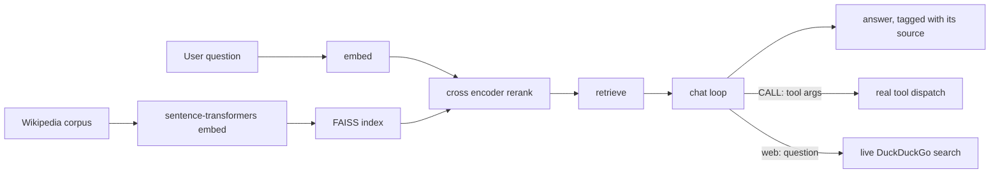

# Tern AI

I trained a GPT-2 sized language model from scratch on a single RTX 4070
SUPER, no pretrained weights, random init, and built the retrieval and
tool use layer around it myself. This repo is that project.

## The short version

The model is a 124M parameter GPT-2, trained on OpenWebText from a random
initialization, roughly one full epoch (about 9 billion tokens), on one
consumer GPU. There's a vector database behind it too: 6.4 million
Wikipedia articles, embedded and indexed with FAISS, reranked with a cross
encoder so the model isn't just grabbing whatever's closest in embedding
space and hoping it's relevant.

On top of that, the fine tuned model can pull from that index when it has
a real match, call a calculator or datetime tool when the question needs
one, fall back to a live DuckDuckGo search when asked to, or just say it
doesn't know. It doesn't bluff.

## How it fits together

The model only ever sees three prompt shapes: grounded context, a tool
call, or an honest no match. The chat loop's whole job is figuring out
which one applies and backing it with something real instead of letting
the model just make something up.

## Why this project actually took work

The model being small isn't really the point. Getting the whole pipeline
to work correctly against real data, at real scale, is where most of the
time went.

Training silently slowed down 4.6x partway through, from about 8 seconds
an iteration to 40, with no error and no crash. Turned out to be a Windows
NVIDIA driver feature quietly spilling VRAM overflow into system RAM.
Nothing logs that. You just have to know to look for it.

The fine tuning data had a real bug in it too. The model was being trained
on the wrong shape of prompt for its own tool calling feature, which meant
it would have learned to never actually call a tool, silently. Only found
that by running the trained model against real test cases and checking
what it actually did.

The FAISS index missed a confirmed true nearest neighbor at its default
settings. Not a close call, a real known article, ranked third overall,
just never showing up in the results. Fixed it by testing against the
whole 6.4 million row corpus and finding exactly where the setting had to
move before it stopped happening.

I also wrote a disambiguation page filter based on Wikipedia's actual
style guide instead of guessing at a regex, and the first version of it
deleted a few thousand real articles by accident. Caught that with
adversarial testing, fixed it, and added a real regression suite before
it shipped.

One upgrade I tried and backed out of: swapping in a better reranker
model. The research said it should help. Testing it against the actual
gate logic showed it broke a case that used to work, so it didn't ship.
Everything in this project got verified by actually running it, not by
trusting a paper or a benchmark number.

## Stack

PyTorch, a GPT-2 implementation built from scratch, tiktoken, FAISS,
sentence-transformers for embeddings and reranking, SQLite, ddgs for live
search. Nothing hosted, nothing managed, no third party API for the model
itself.
