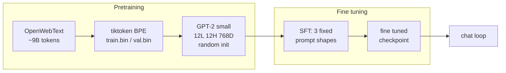
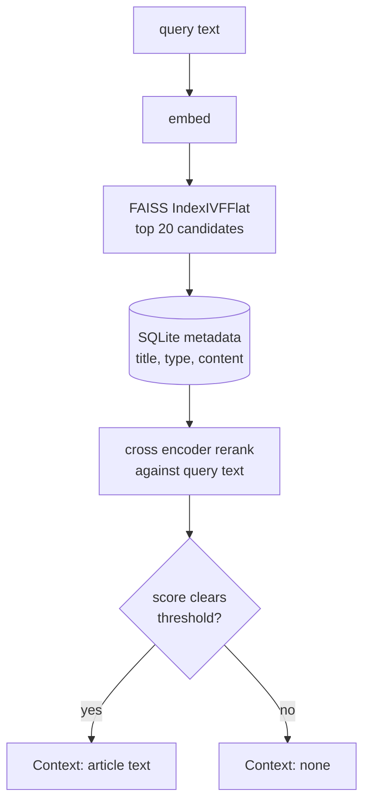

# Tern AI

A GPT-2 sized language model trained from scratch on a single RTX 4070
SUPER, with a self built retrieval and tool use layer around it. No
pretrained weights, random initialization, one consumer GPU.

## Model

Standard GPT-2 small config: 12 layers, 12 attention heads, 768 embedding
dimensions, 1024 token context window, 124M parameters. Trained on
OpenWebText from random init, roughly one full epoch, about 9 billion
tokens.



Base pretraining and fine tuning are two separate stages with their own
checkpoints. An orchestrator script checks checkpoint state on start and
resumes or advances automatically, so a multi day run can be paused and
picked back up without manual bookkeeping.

## Retrieval

The knowledge base is 6.4 million Wikipedia articles, embedded with
sentence-transformers and indexed with FAISS (`IndexIVFFlat`, 65,536
clusters, inner product metric). A query gets embedded the same way,
FAISS returns a shortlist of candidates, and a cross encoder reranks that
shortlist against the actual query text.



Raw embedding distance alone isn't reliable at this scale, short or vague
queries can land close to an unrelated article by coincidence, so the
rerank score against the real query text is what gates whether a match
counts as confident. Disambiguation stub pages are filtered out before
reranking so a thin "X may refer to" page never outranks the real article.

## Chat loop

The fine tuned model only ever sees three prompt shapes at training time,
and the chat loop's job is picking the right one at inference time and
grounding it in something real:


Tool calls and web search results are never routed back through the model
to be rephrased. A calculator result or a live search hit is already
correct, so the loop prints it as is instead of giving the model a chance
to say something wrong on top of a right answer.

## Stack

PyTorch, a GPT-2 implementation built from scratch, tiktoken, FAISS,
sentence-transformers for embeddings and reranking, SQLite, ddgs for live
search. Nothing hosted, nothing managed, no third party API for the model
itself.

## Running it

One entry point, `gui.bat`, a small tkinter app with three tabs:

```
Train    start/stop pretraining and fine tuning, auto resumes and moves
         to the next stage on its own, live log output
Talk     talk to whatever checkpoint currently exists, raw completion,
         no retrieval, no tools
Chat     the real interface, needs fine tuning to be done, retrieval
         and tool use both live here
```

In the Chat tab, typing a plain question uses the local model and index.
Prefixing a question with `web: ` searches DuckDuckGo live instead and
prints the result directly, never through the model.
